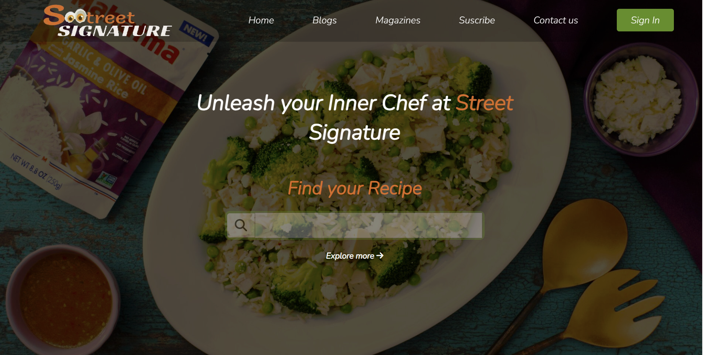

# Cooking Website

This is the repository for the Cooking Website project inspired by a Dribbble design created with HTML, CSS, and JavaScript.

https://dribbble.com/shots/22764603-COOKING-WEBSITE

## Description

Cooking Website is a website designed to showcase recipes, blogs, magazines, and content related to cooking. It includes home, blogs, magazines, registration, and contact sections. The site is fully responsive and utilizes modern web technologies such as HTML5, CSS3, and JavaScript.

## Features

- Home, blogs, magazines, and contact sections.
- Side menu with navigation.
- Subscription form to receive updates.
- Integration of YouTube videos.
- Responsive design to adapt to different screen sizes.

## Author

- [Mansour Lo lo ](mansourlol440@gmail.com)

## License

This project is under the MIT License. See the [LICENSE](LICENSE) file for more details.

## Acknowledgments

- I appreciate [Dribbble](https://dribbble.com) for the inspiration for this project.

Enjoy exploring Cooking Website!